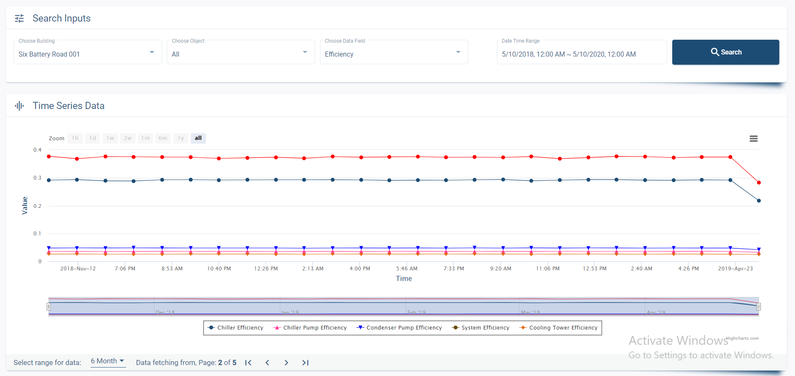
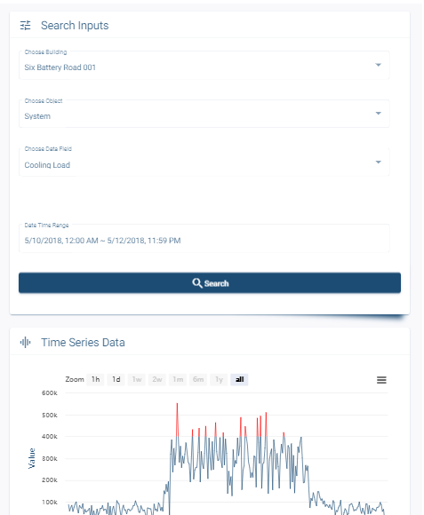

# An Analysis on Big Data Pulling Performance [Frontend]

## Tools

* Angular 9
* Angular Material
* Highcharts 8.1.0
* Apollo GraphQL-Angular
* CSS Flex 

## Backend Git Repository

https://gitlab.com/iamonlysaiful/s3-bigdata-performance-test-backend

In given link I provided my backend project including specific details with README.md

## Prerequisites

* Node.js
* NPM
* Angular 
* optionally install a good IDE with TypeScript support, e.g. VS Code

##  Dependency Installation

Run CMD/Powershell as Administrator at Cloned Directory and run command given bellow:

> npm i

## Project 

In brief, In this project I tried to portray possible all features of professional projects within given criteria.

Here is my Project Structure:

* app
  * app-main
    * s3itest
  * app-pagination
    * pagination
  * models
    * queries
  * package
    * charts
    * forms
  * service

#### app
Here **app** is the parent module of all module. It holds all other modules and their components on it

#### app-main
**app-main** is a sub-module here. Actually it holds main component of project. By created this module 
I tried to portray the pattern of **Lazy Loading Routes** 

#### app-pagination
**app-pagination** is another sub-module.Purpose of it is chart pagination. It is possible to use like **Extension** all over porject. 

#### models
It holds all typescript models. and **query** holds all graphql queries typescript models 

#### package
It holds all dynamic components e.g. **charts**,**forms**, Which can reuse all over the project. By these I implement **Component Interaction** 
over Project.
 
#### service
Here I included my api related service and other reusable or utility type functionality to increase **Modularity**.

#### graphql.module.ts
This module.ts generally hold graphql-apollo client configuration for angular globally.
I also included **Global Error Interceptor** here.

## Feature Discussion

> Material Design,

> Reactive Form validation, 

> Component Interaction

> Lazy routing

> Reusable component

> Higstock chart

#### Screenshots

**Material Datetime picker**

N.B. *After Selecting First and Last Date Select Set* to apply date range.

**Range Selector, Navigator, Pagination implemented**

N.B. *Range Selector & Navigation works on page **Size** of pagination*.I mean Size Dropdown of pagination set area for Range Selector & Navigation

**Data Grouping and Average value for Long DateRange Implemented**

N.B. ***Weekly** grouped for **6 Month Range** & **Monthly** grouped for **1 Year Range***.

**Healthy Baseline Implemented for System Efficiency & System Cooling Load**

N.B. *Greater than 0.45 is healthy for **System Efficency** Less than 400k is healthy for **System Cooling Load**.*

**Responsive UI**

## Feedback

Any feedback would be gratefully recieved!

Thanks, iamonlysaiful@outlook.com